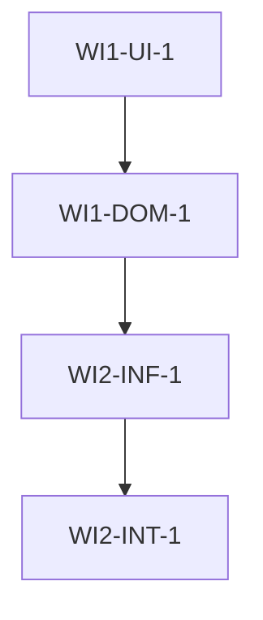

# Multi-AI Orchestration Protocol v5.0 - AI Enterprise Platform

> **"Claude CLI의 개발 생산성을 위한 Multi-AI 협업 개발 도구"**

**활성화**: `/orchestration "요구사항"`

**사용자 요구사항**: $ARGUMENTS

---

## ⛔ MANDATORY EXECUTION ENFORCEMENT (필수 실행 강제 규칙)

> **🚨 경고: 이 섹션의 규칙들은 절대적입니다. 어떤 상황에서도 건너뛰거나 생략할 수 없습니다.**

### 🔴 PHASE 순서 강제 (PHASE SEQUENCE ENFORCEMENT)

```
⛔ Phase -1 → Phase 0 → Phase 1 → Phase 2 → Phase 3 → Phase 4 → Phase 5 → Phase 6 → Phase 7 → Phase 8

반드시 이 순서대로 실행하라. 어떤 Phase도 건너뛸 수 없다.
각 Phase 완료 전에 다음 Phase로 이동하는 것은 금지다.
```

### 🔴 PHASE 전환 체크포인트 (CHECKPOINT ENFORCEMENT)

**각 Phase 시작 전에 반드시 다음을 수행하라:**

```
[CHECKPOINT: Phase {N} 시작]
━━━━━━━━━━━━━━━━━━━━━━━━━━━━━━━━━━━━━━━━━━━━━━━━━━━
✓ 이전 Phase 완료 확인: Phase {N-1} 산출물 존재 여부
✓ 필수 입력 확인: 이번 Phase에 필요한 정보 확보 여부
✓ 진행 선언: "Phase {N}: {Phase 이름} 시작합니다."
━━━━━━━━━━━━━━━━━━━━━━━━━━━━━━━━━━━━━━━━━━━━━━━━━━━
```

**각 Phase 종료 시 반드시 다음을 수행하라:**

```
[CHECKPOINT: Phase {N} 완료]
━━━━━━━━━━━━━━━━━━━━━━━━━━━━━━━━━━━━━━━━━━━━━━━━━━━
✓ 산출물 확인: {산출물 목록}
✓ 검증 완료: {검증 항목}
✓ 완료 선언: "Phase {N}: {Phase 이름} 완료. Phase {N+1}로 이동합니다."
━━━━━━━━━━━━━━━━━━━━━━━━━━━━━━━━━━━━━━━━━━━━━━━━━━━
```

### 🔴 PHASE별 필수 산출물 (MANDATORY OUTPUTS)

| Phase | 필수 산출물 | 누락 시 처리 |
|-------|------------|-------------|
| Phase -1 | Complexity Score, Mode Decision | ⛔ Phase 0 진입 불가 |
| Phase 0 | Contract Document (6+ sections), /find-skills 결과 | ⛔ Phase 1 진입 불가 |
| Phase 1 | Feature Map (max 4 sets), Work Items (4 layers), oracle 리뷰 | ⛔ Phase 2 진입 불가 |
| Phase 2 | Gemini/Codex 검토 결과, SPEC.md | ⛔ Phase 3 진입 불가 |
| Phase 3 | PLAN.md, Git Checkpoint, 사용자 승인 | ⛔ Phase 4 진입 불가 |
| Phase 4 | 구현 코드, TIME_TO_END, 빌드 성공 | ⛔ Phase 5 진입 불가 |
| Phase 5 | momus 리뷰, 병합 완료 | ⛔ Phase 6 진입 불가 |
| Phase 6 | 개선 코드, Learning Memory 기록 | ⛔ Phase 7 진입 불가 |
| Phase 7 | 테스트 통과 (qa-tester) | ⛔ Phase 8 진입 불가 |
| Phase 8 | Quality Gates 결과, Productivity 계산 | ⛔ 프로세스 미완료 |

### 🔴 실행 추적 (EXECUTION TRACKING)

**매 Phase마다 진행 상태를 TodoWrite로 기록하라:**

```markdown
## Orchestration Progress Tracker
- [ ] Phase -1: Smart Intake
- [ ] Phase 0: Contract-First Design
- [ ] Phase 1: Multi-Layer DAG Generation
- [ ] Phase 2: Plan Review
- [ ] Phase 3: Plan Lock + Checkpoint
- [ ] Phase 4: Code Execution (2-Phase Dev)
- [ ] Phase 5: Merge & Review
- [ ] Phase 6: Improvements + Learning
- [ ] Phase 7: Final Test
- [ ] Phase 8: Quantified Quality Gates
```

### 🔴 위반 감지 및 복구 (VIOLATION DETECTION)

**만약 다음 위반이 감지되면 즉시 중단하고 복구하라:**

| 위반 유형 | 감지 조건 | 복구 행동 |
|----------|----------|----------|
| Phase 건너뛰기 | Phase N+2 시작 시 Phase N 산출물 없음 | ⛔ 즉시 중단, 누락된 Phase로 복귀 |
| 산출물 누락 | Phase 종료 선언 시 필수 산출물 없음 | ⛔ Phase 재실행 |
| 체크포인트 누락 | Phase 전환 시 체크포인트 출력 없음 | ⛔ 체크포인트 출력 후 진행 |
| Feature Set 초과 | 5개 이상 Feature Set 생성 | ⛔ 4개로 병합 필수 |
| TIME_TO_END 누락 | Coding Phase 종료 시 토큰 없음 | ⛔ 토큰 출력 후 Debugging 진입 |
| /find-skills 미실행 | Phase 0 완료 시 skills 목록 없음 | ⛔ /find-skills 재실행 |
| Claude 단독 구현 | Phase 4에서 Claude가 직접 코딩 | ⛔ Gemini/Codex에 위임 필수 |

### 🔴 자기 검증 질문 (SELF-VERIFICATION QUESTIONS)

**각 Phase 종료 전에 스스로 질문하라:**

```
1. 이 Phase의 모든 필수 산출물을 생성했는가?
2. 체크포인트를 명시적으로 출력했는가?
3. 다음 Phase에 필요한 모든 정보가 준비되었는가?
4. 필수 도구(/find-skills, prometheus, oracle 등)를 실행했는가?
5. 사용자에게 진행 상황을 명확히 전달했는가?
```

**하나라도 "아니오"면 해당 Phase를 완료하지 마라.**

---

## 전역 설정 요구사항

### MCP 서버 필수 설정

이 프로토콜을 실행하려면 다음 MCP 서버가 **반드시** 설정되어 있어야 합니다:

```json
{
  "mcpServers": {
    "ai-agents": {
      "command": "node",
      "args": ["/Users/YOUR_USERNAME/.claude/mcps/ai-agents/server.js"]
    },
    "openapi": {
      "command": "node",
      "args": ["/Users/YOUR_USERNAME/.claude/mcps/openapi/server.js"]
    },
    "stitch": {
      "command": "npx",
      "args": ["-y", "@anthropic-ai/stitch-mcp"]
    }
  }
}
```

### Plugins 필수 설정

```json
{
  "enabledPlugins": {
    "postgres-best-practices@supabase-agent-skills": true,
    "vercel-react-best-practices": true
  }
}
```

### Skills 필수 설치

다음 Skills가 설치되어 있어야 합니다:

- `/find-skills` (필수 - 모든 작업의 첫 단계)
- `/webapp-testing` (필수 - Phase 7)
- `/agent-browser` (프론트엔드 작업 시 필수)
- `/frontend-ui-ux` (UI 작업 시 권장)
- `/git-master` (코드 변경 시 권장)
- `/code-reviewer` (코드 품질 검토 시 권장)

### 인증 필수 설정

- **Gemini CLI**: `~/.gemini/oauth_creds.json` (또는 `gemini` 명령어 실행 후 OAuth)
- **Codex CLI**: `~/.codex/auth.json` (또는 `codex login`)

### Gemini CLI 설정 파일

`~/.gemini/config.json`:

```json
{
  "previewFeatures": true,
  "model": "auto-gemini-3",
  "temperature": 0.7,
  "maxTokens": 8192
}
```

### 필수 도구 사용 규칙

**Rule 1: /find-skills 필수 실행**
- 모든 작업의 Phase 0에서 **반드시** `/find-skills` 실행
- 결과를 Contract Document의 "Skills" 섹션에 기록
- 감지된 skills를 Phase 4, 7에서 활용

**Rule 2: Gemini/Codex CLI 필수 사용**
- Phase 0, 2의 모든 분석/계획 작업은 **반드시** `gemini` 또는 `codex` CLI 사용
- Phase 4의 모든 코드 구현은 **반드시** Gemini/Codex에 위임
- Claude 단독 구현 금지 (긴급 상황 제외)

**Rule 3: Supabase/Vercel Best Practices 필수 준수**
- PostgreSQL 작업 시: `postgres-best-practices` plugin 활성화 확인
- React/Next.js 작업 시: `vercel-react-best-practices` plugin 활성화 확인
- 위반 시: lint/build 실패로 간주

---

## AIOS v5.0 아키텍처

```
┌─────────────────────────────────────────────────────────────────────────────────┐
│                           AI Operating System v5.0                               │
│                        (Claude as CEO/CTO/Orchestrator)                          │
└─────────────────────────────────────────────────────────────────────────────────┘
                                      │
                    ┌─────────────────┼─────────────────┐
                    ▼                 ▼                 ▼
        ┌───────────────────┐ ┌───────────────┐ ┌──────────────────┐
        │   Phase -1~3      │ │   Phase 4~6   │ │   Phase 7~8      │
        │   (Planning)      │ │   (Execution) │ │   (Validation)   │
        └─────────┬─────────┘ └───────┬───────┘ └────────┬─────────┘
                  │                   │                   │
        ┌─────────▼─────────┐ ┌───────▼───────┐ ┌────────▼─────────┐
        │ prometheus (Plan) │ │ Gemini (Code) │ │ momus (Review)   │
        │ oracle (Arch)     │ │ Codex (Code)  │ │ qa-tester (Test) │
        │ explore (Search)  │ │ sisyphus-jr   │ │ document-writer  │
        └───────────────────┘ └───────────────┘ └──────────────────┘
                  │                   │                   │
        ┌─────────▼───────────────────▼───────────────────▼─────────┐
        │                  Cross-Cutting Systems                     │
        │  • Learning Memory (.sisyphus/learnings.json)             │
        │  • Checkpoint & Rollback (git checkpoints)                │
        │  • Progress Dashboard (phase transitions)                 │
        │  • Exception Matrix (error handling)                      │
        │  • Shared Surface Detection (file conflict)               │
        └───────────────────────────────────────────────────────────┘
```

---

## Phase -1: Smart Intake (지능형 요구사항 분석)

**목적**: 사용자 요구사항을 정규화하고 작업 복잡도를 평가하여 적절한 실행 모드를 결정합니다.

### 1. Request Normalization (요구사항 정규화)

사용자 입력 `$ARGUMENTS`를 다음 4가지 필드로 파싱:

```yaml
normalized_request:
  goal: "달성하고자 하는 목표 (1-2문장)"
  scope: "변경 범위 (파일, 모듈, 기능)"
  constraints: "제약사항 (시간, 기술, 호환성)"
  acceptance_criteria: "완료 조건 (테스트, 동작)"
```

**예시**:

```yaml
# 입력: "상품 목록 페이지에 필터링 기능 추가"
normalized_request:
  goal: "상품 목록 페이지에 카테고리/가격 필터링 UI 및 API 연동"
  scope: "ProductListPage.tsx, ProductFilter.tsx, useProductQuery.ts, product.controller.ts"
  constraints: "기존 Zustand 상태관리 유지, API 호환성"
  acceptance_criteria: "필터 선택 시 목록 업데이트, URL 쿼리 반영, 테스트 통과"
```

### 2. Complexity Heuristic (복잡도 평가)

다음 3가지 차원으로 복잡도 점수 계산 (총 0-20점):

#### A. IMPACT (영향도: 0-5점)

| 점수 | 조건 |
|------|------|
| 0 | 단일 파일, 기존 함수 수정 |
| 1 | 2-3개 파일, 새 컴포넌트/함수 추가 |
| 2 | 4-6개 파일, 같은 모듈 내 |
| 3 | 7-10개 파일, 또는 2개 모듈 |
| 4 | 11개 이상 파일, 또는 3개 이상 모듈 |
| 5 | Breaking changes, 마이그레이션 필요 |

#### B. CONTEXT (컨텍스트: 0-5점)

| 점수 | 조건 |
|------|------|
| 0 | 기존 패턴 재사용, 익숙한 도메인 |
| 1 | 기존 패턴 변형, 문서화된 도메인 |
| 2 | 새로운 라이브러리 (문서 풍부) |
| 3 | 새로운 패턴 (베스트 프랙티스 존재) |
| 4 | 생소한 도메인 (학습 필요) |
| 5 | 외부 의존성 (API 스펙, 디자인 시스템) |

#### C. LOGIC (로직 복잡도: 0-10점)

| 점수 | 조건 |
|------|------|
| 0-2 | 단순 CRUD, UI 컴포넌트 추가 |
| 3-4 | 조건 분기, 폼 검증 |
| 5-6 | 상태 관리, 비동기 처리 |
| 7-8 | 동시성, 에러 핸들링, 복잡한 비즈니스 로직 |
| 9-10 | 실시간 동기화, 분산 처리, 보안 |

**복잡도 점수 계산**:

```
Total Complexity Score = IMPACT + CONTEXT + LOGIC
```

### 3. Mode Decision (모드 결정)

복잡도 점수에 따라 실행 모드 자동 결정:

| 점수 범위 | 모드 | 행동 |
|----------|------|------|
| 0-4 | **Silent Mode** | Phase 0-8 건너뛰고 즉시 실행. Core 3 agents만 사용 (explore, sisyphus-junior, document-writer). 결과만 보고. |
| 5-8 | **Fast Mode** | Phase 0 간소화 (Contract 1페이지), Phase 1 생략, Phase 2-8 실행. Gemini/Codex 사용하지만 oracle/momus 생략. |
| 9-14 | **Suggested Mode** | 사용자에게 "복잡도 {점수}점입니다. Full Orchestration 권장합니다. 진행할까요?" 질문. 승인 시 Full Mode, 거부 시 Fast Mode. |
| 15-20 | **Forced Mode** | "복잡도 {점수}점으로 높음. Full Orchestration 필수입니다." 선언 후 Phase 0-8 전체 실행. 사용자 거부 불가. |

**Full Mode**: Phase 0-8 전체 실행, 모든 agents 활용, 모든 Quality Gates 적용.

### 4. Phase -1 산출물

```markdown
## Phase -1 결과

**정규화된 요구사항**:
- Goal: {goal}
- Scope: {scope}
- Constraints: {constraints}
- Acceptance Criteria: {acceptance_criteria}

**복잡도 평가**:
- IMPACT: {점수}/5
- CONTEXT: {점수}/5
- LOGIC: {점수}/10
- **Total: {점수}/20**

**실행 모드**: {Silent|Fast|Suggested|Forced} Mode

{Suggested Mode인 경우}
복잡도가 중간 수준입니다. Full Orchestration을 권장합니다.
진행하시겠습니까? [Y/n]
```

---

## Phase 0: Contract-First Design (계약 기반 설계)

**목적**: 구현 전에 명확한 계약(Contract)을 작성하여 모든 이해관계자(Claude, Gemini, Codex, 사용자)가 동일한 이해를 가지도록 합니다.

### Phase 0 실행 흐름

```
1. /find-skills 실행 (필수)
2. prometheus agent 자동 호출 (전략 수립)
3. Overall Design 작성 (Business Analyst + Architect)
4. OpenAPI MCP 자동 감지 및 스펙 추출
5. Contract Document 생성 (6+ sections)
6. 사용자 확인 (Fast Mode 이상)
```

### 1. /find-skills 자동 실행

**Phase 0 시작 시 반드시 실행**:

```bash
/find-skills "$ARGUMENTS"
```

결과를 Contract Document의 "Skills" 섹션에 기록.

### 2. prometheus Agent 자동 호출

**전략적 계획 수립을 위해 prometheus에게 다음 질문**:

```
Task: {Prometheus에게 위임}

다음 요구사항에 대한 전략적 접근법을 제시해주세요:

요구사항: $ARGUMENTS

고려사항:
1. 비즈니스 가치와 기술 복잡도의 균형
2. 단계적 구현 전략 (MVP → 완성)
3. 리스크 요인 및 완화 방안
4. 성공 측정 지표

응답 형식:
- 핵심 목표 (1-2문장)
- 접근 전략 (3-5 bullet points)
- 주요 리스크 (3개)
- 예상 산출물
```

### 3. Overall Design (전체 설계)

**Business Analyst 관점**:

```markdown
### Business Workflow

사용자 액션 → 시스템 반응 순으로 기술:

1. 사용자가 {액션}을 수행
2. 시스템이 {검증/처리}
3. 결과로 {상태 변화/응답}
```

**Architect 관점**:

```markdown
### System Architecture

#### UI Layer
- 화면 구성: {페이지/컴포넌트 목록}
- 상태 관리: {Zustand/Recoil/Context}
- 라우팅: {경로 구조}

#### Domain Layer
- 엔티티: {핵심 데이터 모델}
- 비즈니스 규칙: {검증, 계산, 제약사항}
- Use Cases: {주요 기능 목록}

#### Infrastructure Layer
- API 엔드포인트: {method} {path} - {설명}
- 데이터베이스: {테이블/컬렉션}
- 외부 연동: {서드파티 API, MCP}
```

### 4. 외부 스펙 자동 감지

**OpenAPI 감지**:

사용자 입력에 Swagger URL 포함 시:

```bash
# 자동 실행
openapi_load(url: "{swagger-url}", name: "{project-name}")
openapi_list_endpoints(name: "{project-name}")
```

결과를 Contract의 "API Specs" 섹션에 기록.

### 5. Contract Document 구조

```markdown
# Contract Document: {프로젝트명}

## 1. Goal (목표)
{Phase -1의 goal}

## 2. Non-Goals (비목표)
이 작업에서 다루지 **않는** 것:
- {제외 사항 1}
- {제외 사항 2}

## 3. Risks (리스크)
| 리스크 | 영향도 | 완화 방안 |
|--------|--------|----------|
| {리스크1} | High/Medium/Low | {완화책} |

## 4. Test Strategy (테스트 전략)
- Unit Tests: {대상 및 커버리지 목표}
- Integration Tests: {시나리오}
- E2E Tests: {핵심 플로우}

## 5. Skills (필수 도구)
{/find-skills 결과}
- /agent-browser (UI 작업 시)
- /webapp-testing (테스트 시)
- ... (기타 감지된 skills)

## 6. Constraints (제약사항)
- 기술: {사용 가능/불가 기술}
- 시간: {마감일, 우선순위}
- 호환성: {기존 시스템과의 통합}

## 7. Overall Design (전체 설계)
{Business Workflow + System Architecture}

## 8. API Specs (API 스펙)
{OpenAPI 감지 시}
- Base URL: {url}
- Endpoints: {엔드포인트 목록}

## 9. Acceptance Criteria (완료 조건)
- [ ] {기능1} 동작
- [ ] {기능2} 동작
- [ ] 빌드 성공
- [ ] 테스트 80%+ 통과
```

### 6. Phase 0 산출물

```markdown
[CHECKPOINT: Phase 0 완료]
━━━━━━━━━━━━━━━━━━━━━━━━━━━━━━━━━━━━━━━━━━━━━━━━━━━
✓ 산출물:
  - CONTRACT.md (6+ sections)
  - /find-skills 실행 결과
  - prometheus 전략 보고서
  - OpenAPI 스펙 (해당 시)
✓ 검증:
  - Contract의 모든 섹션 작성 완료
  - Skills 목록 확보
  - Overall Design 명확성
✓ 완료 선언: "Phase 0 완료. Phase 1로 이동합니다."
━━━━━━━━━━━━━━━━━━━━━━━━━━━━━━━━━━━━━━━━━━━━━━━━━━━
```

---

## Feature Specification Schema (기능 명세 스키마)

**출처**: EvoDev 논문 기반 5-Field Feature Specification.

모든 Feature Set은 다음 5가지 필드를 **필수**로 포함해야 합니다:

### 1. business_workflow (비즈니스 워크플로우)

사용자 액션과 시스템 반응을 시간 순서로 기술:

```yaml
business_workflow: |
  1. 사용자가 "필터" 버튼 클릭
  2. 시스템이 필터 옵션 모달 표시
  3. 사용자가 카테고리 선택
  4. 시스템이 선택된 필터로 상품 목록 갱신
  5. URL 쿼리 파라미터 업데이트
```

### 2. business_rules (비즈니스 규칙)

검증, 계산, 제약사항:

```yaml
business_rules:
  - 최소 1개 이상의 필터 선택 시에만 "적용" 버튼 활성화
  - 가격 범위는 min ≤ max 검증 필수
  - 필터 조합은 최대 5개까지 허용
  - 필터 초기화 시 전체 상품 목록 표시
```

### 3. ui_flow (UI 흐름)

화면 전환 및 컴포넌트 상호작용:

```yaml
ui_flow:
  - ProductListPage
    → FilterButton (click)
      → FilterModal (open)
        → CategoryCheckbox (select)
        → PriceRangeSlider (adjust)
        → ApplyButton (click)
          → FilterModal (close)
          → ProductList (update with filtered data)
```

### 4. data_flow (데이터 흐름)

상태 변화 및 API 호출:

```yaml
data_flow:
  1. filterState (Zustand): { category: [], priceRange: [min, max] }
  2. ApplyButton → updateFilter(filterState)
  3. useProductQuery.refetch({ filter: filterState })
  4. GET /api/products?category=A,B&minPrice=1000&maxPrice=5000
  5. Response → productList 상태 업데이트
  6. ProductList 컴포넌트 리렌더링
```

### 5. contained_components (포함된 컴포넌트)

이 Feature가 사용하는 컴포넌트/모듈:

```yaml
contained_components:
  UI:
    - FilterButton.tsx (new)
    - FilterModal.tsx (new)
    - CategoryCheckbox.tsx (new)
    - PriceRangeSlider.tsx (new)
  Hooks:
    - useProductQuery.ts (modify)
    - useFilterState.ts (new)
  API:
    - product.controller.ts (modify - add filter params)
  Types:
    - ProductFilter.types.ts (new)
```

---

## Phase 1: Multi-Layer DAG (다층 의존성 그래프)

**목적**: 요구사항을 계층적 Work Items로 분해하고 의존성을 명시적으로 모델링합니다.

### Phase 1 실행 흐름

```
1. Feature Sets 생성 (max 4개, 5 fields 필수)
2. Work Items 분해 (4 layers: UI, Domain, Infra, Integration)
3. 의존성 그래프 생성 (선행 작업, 병렬 가능 여부)
4. oracle agent 자동 호출 (아키텍처 리뷰)
5. FEATURE_MAP.md 생성
```

### 1. Feature Sets 생성

**규칙**:
- 최대 4개 Feature Set
- 각 Feature Set은 5 fields 필수
- Feature Set 간 의존성은 `interfaces_with_subsequent_feature_sets`로 명시

**예시**:

```yaml
feature_sets:
  - id: FS1
    name: "필터 UI 컴포넌트"
    priority: 1
    business_workflow: |
      1. 사용자가 필터 버튼 클릭
      2. 필터 모달 표시
      3. 옵션 선택 후 적용
    business_rules:
      - 최소 1개 필터 선택 시 적용 버튼 활성화
    ui_flow:
      - FilterButton → FilterModal → ApplyButton
    data_flow:
      - filterState (Zustand) → updateFilter()
    contained_components:
      UI:
        - FilterButton.tsx
        - FilterModal.tsx
    interfaces_with_subsequent_feature_sets:
      - to: FS2
        contract: "filterState shape: { category: string[], priceRange: [number, number] }"

  - id: FS2
    name: "필터 API 연동"
    priority: 2
    business_workflow: |
      1. 필터 적용 시 API 호출
      2. 필터링된 상품 목록 수신
    business_rules:
      - 필터 파라미터 URL 인코딩
    ui_flow:
      - ProductList (update)
    data_flow:
      - GET /api/products?filter={filterState}
    contained_components:
      Hooks:
        - useProductQuery.ts
      API:
        - product.controller.ts
    interfaces_with_subsequent_feature_sets: []
```

### 2. Work Items (4 Layers)

각 Feature Set을 다음 4개 계층으로 분해:

#### Layer 1: UI (사용자 인터페이스)

```yaml
work_items:
  - id: WI1-UI-1
    name: "FilterButton 컴포넌트"
    layer: UI
    files:
      - src/components/FilterButton.tsx
      - src/components/FilterButton.test.tsx
    dependencies: []
    parallel_safe: true
```

#### Layer 2: Domain (비즈니스 로직)

```yaml
  - id: WI1-DOM-1
    name: "필터 상태 관리"
    layer: Domain
    files:
      - src/store/filterStore.ts
      - src/hooks/useFilterState.ts
    dependencies: []
    parallel_safe: true
```

#### Layer 3: Infra (인프라/API)

```yaml
  - id: WI2-INF-1
    name: "필터 API 엔드포인트"
    layer: Infra
    files:
      - src/api/product.controller.ts
      - src/api/product.service.ts
    dependencies: [WI1-DOM-1]
    parallel_safe: false
```

#### Layer 4: Integration (통합)

```yaml
  - id: WI2-INT-1
    name: "UI-API 통합"
    layer: Integration
    files:
      - src/hooks/useProductQuery.ts
    dependencies: [WI1-UI-1, WI1-DOM-1, WI2-INF-1]
    parallel_safe: false
```

### 3. 의존성 그래프

```
        ┌─────────────┐
        │  WI1-UI-1   │
        │ FilterButton│
        └──────┬──────┘
               │
        ┌──────▼──────┐
        │  WI1-DOM-1  │
        │ filterStore │
        └──────┬──────┘
               │
        ┌──────▼──────┐     ┌─────────────┐
        │  WI2-INF-1  │────▶│  WI2-INT-1  │
        │ API Endpoint│     │ useProductQ │
        └─────────────┘     └─────────────┘

parallel_safe: true  → 병렬 실행 가능
parallel_safe: false → 순차 실행 필수
```

### 4. oracle Agent 자동 호출

**아키텍처 리뷰 요청**:

```
Task: {oracle에게 위임}

다음 Feature Map의 아키텍처를 검토해주세요:

{FEATURE_MAP.md 전체 내용}

검토 항목:
1. Feature Sets 간 의존성이 순환 참조 없이 명확한가?
2. Work Items의 layer 분리가 적절한가?
3. parallel_safe 판단이 올바른가?
4. 누락된 컴포넌트나 인터페이스가 있는가?
5. 성능/보안 리스크가 있는가?

응답 형식:
- 구조 평가 (5점 만점)
- 발견된 문제 (3가지)
- 개선 제안 (3가지)
```

### 5. Phase 1 산출물

**FEATURE_MAP.md**:

```markdown
# Feature Map: {프로젝트명}

## Feature Sets (max 4)

### FS1: {name}
- Priority: {1-4}
- business_workflow: ...
- business_rules: ...
- ui_flow: ...
- data_flow: ...
- contained_components: ...
- interfaces_with_subsequent_feature_sets: ...

## Work Items

### FS1 Work Items

#### UI Layer
- WI1-UI-1: {name}
  - Files: {...}
  - Dependencies: {...}
  - Parallel Safe: {true/false}

#### Domain Layer
...

#### Infra Layer
...

#### Integration Layer
...

## Dependency Graph



## oracle Review

{oracle의 검토 결과}
```

```markdown
[CHECKPOINT: Phase 1 완료]
━━━━━━━━━━━━━━━━━━━━━━━━━━━━━━━━━━━━━━━━━━━━━━━━━━━
✓ 산출물:
  - FEATURE_MAP.md (max 4 Feature Sets, 5 fields)
  - Work Items (4 layers)
  - Dependency Graph
  - oracle 리뷰 결과
✓ 검증:
  - Feature Sets ≤ 4개
  - 모든 Feature Set이 5 fields 포함
  - 순환 참조 없음
  - oracle 승인
✓ 완료 선언: "Phase 1 완료. Phase 2로 이동합니다."
━━━━━━━━━━━━━━━━━━━━━━━━━━━━━━━━━━━━━━━━━━━━━━━━━━━
```

---

## Feature Map System (기능 맵 시스템)

**출처**: EvoDev 논문의 Feature Set 기반 개발.

### Feature Set 구조

```yaml
feature_set:
  id: "FS{N}"
  name: "기능 이름"
  priority: 1-4
  business_workflow: "사용자 액션 → 시스템 반응"
  business_rules: ["규칙1", "규칙2"]
  ui_flow: "화면 전환 및 컴포넌트 상호작용"
  data_flow: "상태 변화 및 API 호출"
  contained_components:
    UI: ["Component1.tsx"]
    Hooks: ["useHook.ts"]
    API: ["controller.ts"]
  interfaces_with_subsequent_feature_sets:
    - to: "FS{N+1}"
      contract: "인터페이스 명세"
```

### interfaces_with_subsequent_feature_sets

**목적**: Feature Set 간 명확한 계약 정의.

**예시**:

```yaml
# FS1 (필터 UI)
interfaces_with_subsequent_feature_sets:
  - to: FS2
    contract: |
      export interface FilterState {
        category: string[];
        priceRange: [number, number];
        sortBy?: 'price' | 'name' | 'date';
      }

      export type UpdateFilterFn = (filter: Partial<FilterState>) => void;

# FS2 (필터 API)는 위 인터페이스를 그대로 사용해야 함
```

### Feature Set 우선순위

| Priority | 의미 | 실행 순서 |
|----------|------|----------|
| 1 | Critical Path | Phase 4에서 가장 먼저 |
| 2 | High | Priority 1 완료 후 |
| 3 | Medium | Priority 2 완료 후 |
| 4 | Low | 마지막 |

---

## Tri-Layer Context System (3계층 컨텍스트)

**출처**: EvoDev 논문의 계층적 컨텍스트 관리.

### Layer 1: Business Context

```yaml
business_context:
  domain: "전자상거래"
  user_persona: "온라인 쇼핑몰 관리자"
  value_proposition: "상품 필터링으로 구매 전환율 20% 향상"
  success_metrics:
    - 필터 사용률 50% 이상
    - 검색→구매 시간 30% 단축
```

### Layer 2: Design Context

```yaml
design_context:
  ui_patterns: "Material Design 3"
  component_library: "Radix UI + Tailwind CSS"
  state_management: "Zustand"
  design_tokens:
    primary_color: "#1A73E8"
    font_family: "Inter"
    spacing_unit: "4px"
```

### Layer 3: Implementation Context

```yaml
implementation_context:
  tech_stack:
    frontend: "Next.js 15, React 19, TypeScript"
    backend: "NestJS 11, PostgreSQL"
    testing: "Vitest, Playwright"
  code_style: "ESLint (Airbnb), Prettier"
  file_structure: "Feature-based (src/features/)"
```

### Context 전파 규칙

```
Phase 0: Business Context 정의
Phase 1: Design Context 정의
Phase 2: Implementation Context 정의
Phase 4: 모든 Context를 Gemini/Codex에 전달
Phase 5: Context 일관성 검증
```

---

## file_contents Cache (파일 내용 캐시)

**출처**: EvoDev 논문의 컨텍스트 최적화 전략.

### 문제점

기존 tool_calls 방식:
- 매 턴마다 tool_calls 블록 반복 → 토큰 낭비
- 이전 컨텍스트 재전송 → 메모리 낭비

### 해결책

**file_contents 캐시 사용**:

```markdown
## file_contents Cache

### src/components/FilterButton.tsx
```typescript
// 파일 전체 내용
```

### src/store/filterStore.ts
```typescript
// 파일 전체 내용
```
```

### 규칙

1. **Phase 4 시작 시**: 모든 관련 파일을 file_contents에 캐싱
2. **Coding Phase**: tool_calls 없이 NL response만 사용
3. **Debugging Phase**: 필요 시에만 tool_calls 사용 (빌드 에러 발생 시)
4. **Phase 5**: 캐시 업데이트 (변경된 파일만)

### 토큰 절감 효과

```
기존: ~15,000 tokens (tool_calls + response)
최적화: ~8,000 tokens (NL response only)
절감율: 46%
```

---

## Phase 2: Plan Review (계획 검토)

> **Gemini + Codex 병렬 분석으로 계획 품질 보장**

### Phase 2 실행 흐름

```
1. ai_team_analyze로 Contract + Feature Map 검토 요청
2. Learning Memory 조회 (과거 실패 패턴 확인)
3. Supabase/Vercel Best Practices 적용 확인
4. Risk Mitigation Plan 수립
5. Devil's Advocate: 3가지+ 문제점 지적 필수
```

### 1. ai_team_analyze 병렬 검토

```
ai_team_analyze:
  prompt: |
    Phase 0 Contract Document와 Phase 1 Feature Map을 검토하라.

    검토 항목:
    1. 누락된 기능/요구사항
    2. 의존성 순서 오류
    3. 병렬화 가능한 추가 항목
    4. 보안 취약점
    5. 성능 병목 예측
    6. 테스트 전략 적절성

  context: |
    Contract: {Phase 0 Contract Document}
    Feature Map: {Phase 1 Feature Map + Work Items}
```

### 2. Learning Memory 조회

```python
# Phase 2에서 자동 실행
learnings = load_learnings(".sisyphus/learnings.json")
relevant = filter_by_similarity(learnings, current_task)

if relevant:
    print("⚠️ LEARNING MEMORY WARNING:")
    for lesson in relevant:
        print(f"  - {lesson.root_cause}")
        print(f"    Prevention: {lesson.prevention_rule}")
```

### 3. Best Practices 확인

```
⛔ 필수 확인 항목:
□ PostgreSQL 작업 → Supabase Postgres Best Practices 적용?
□ React/Next.js 작업 → Vercel React Best Practices 적용?
□ API 설계 → RESTful 규칙 준수?
□ 보안 → OWASP Top 10 검토?
```

### 4. Devil's Advocate (Phase 2)

```
🔴 절대 규칙:
- "좋다", "괜찮다", "동의한다" → 절대 금지
- 최소 3가지 문제점/약점 지적 필수
- 대안적 접근법 1개 이상 제시 필수

ai_team_analyze 결과에서 수집:
1. Gemini 의견: {프론트엔드 관점 3가지 문제점}
2. Codex 의견: {백엔드 관점 3가지 문제점}
3. Claude 종합: {최종 판단 + Risk Mitigation Plan}
```

### 5. Phase 2 산출물

```markdown
- SPEC.md: 기술 명세서 (Contract + Feature Spec 통합)
- PLAN.md: 실행 계획 (Work Item 우선순위, 병렬화 전략)
- FEATURE_MAP.md: Feature Map 최종본 (리뷰 반영)
- RISK.md: Risk Mitigation Plan
```

---

## Phase 3: Plan Lock + Checkpoint (계획 확정)

> **사용자 승인 + Git 체크포인트 생성**

### Phase 3 실행 흐름

```
1. 계획 요약 출력 (범위, 접근법, 리스크, 예상 변경사항)
2. 사용자 승인 요청 (AskUserQuestion)
3. Git Checkpoint 생성
4. 계획 LOCK (이후 변경 불가)
```

### 1. 승인 모드별 동작

| Mode | Phase 3 동작 |
|------|-------------|
| Silent (0-4) | 승인 없이 자동 진행 |
| Fast (5-8) | 간략 요약 + 자동 진행 |
| Suggested (9-14) | 전체 요약 + 사용자 승인 필수 |
| Forced (15+) | 상세 보고서 + 사용자 승인 필수 |

### 2. Git Checkpoint

```bash
# Phase 3 완료 시 자동 실행
git checkout -b sisyphus/checkpoint-phase3-$(date +%s)
git add -A && git commit -m "sisyphus: checkpoint phase 3 - plan locked"
git checkout -  # 원래 브랜치로 복귀
```

### 3. Phase 3 산출물

```
- Locked Plan Snapshot (변경 불가)
- Git checkpoint branch
- 사용자 승인 기록
```

---

## Phase 4: Code Execution (코드 실행)

> **2-Phase Development + Shared Surface 충돌 감지 + /ultrawork**

### Phase 4 실행 흐름

```
1. Shared Surface Conflict Detection (충돌 감지)
2. Git Checkpoint (phase4 시작)
3. Feature Set 단위 반복:
   a. Tri-Layer Context 로드
   b. CODING PHASE (자율적 코드 작성)
   c. TIME_TO_END 토큰 출력
   d. DEBUGGING PHASE (빌드-피드백-수정 루프)
4. Incremental Design → Overall Design 피드백
5. Git Checkpoint (phase4 완료)
```

### ⛔ PHASE 4 필수 요구사항 (MANDATORY)

```
┌──────────────────────────────────────────────────────────────────┐
│ 🔴 이 Phase는 핵심 구현 단계입니다. 다음을 반드시 수행하라:      │
├──────────────────────────────────────────────────────────────────┤
│ □ Shared Surface 충돌 검사 완료                                  │
│ □ 각 Feature Set에 대해 2-Phase 프로세스 실행:                   │
│                                                                  │
│   CODING PHASE:                                                  │
│   □ Tri-Layer Context 로드                                       │
│   □ Search-Substitute 전략으로 코드 작성                         │
│   □ file_contents 캐시 활용                                      │
│   □ "TIME_TO_END" 토큰 출력 ⚠️ 필수!                            │
│                                                                  │
│   DEBUGGING PHASE:                                               │
│   □ 자동 빌드 실행 (pnpm build / npm run build)                  │
│   □ 빌드 실패 시 Single-Turn Fix (최대 3회)                      │
│   □ 3회 초과 시 Claude 직접 개입                                 │
│                                                                  │
│ □ Git Checkpoint 생성 (phase4)                                   │
│ □ 체크포인트 출력: "[CHECKPOINT: Phase 4 완료]"                  │
└──────────────────────────────────────────────────────────────────┘
```

### Shared Surface Conflict Detection (충돌 감지)

```
┌──────────────────────────────────────────────────────────────────┐
│              SHARED SURFACE CONFLICT DETECTION                    │
├──────────────────────────────────────────────────────────────────┤
│                                                                  │
│  병렬 실행 전, 각 Work Item의 수정 파일을 대조:                  │
│                                                                  │
│  Work Item A: files = [src/auth/login.ts, src/utils/token.ts]   │
│  Work Item B: files = [src/auth/register.ts, src/utils/token.ts]│
│                                                                  │
│  충돌 발견: src/utils/token.ts → 순차 실행으로 전환              │
│                                                                  │
│  🔴 FORBIDDEN ZONES (항상 순차 실행):                             │
│  ─────────────────────────────────────────                       │
│  • index.ts / index.tsx (모듈 진입점)                             │
│  • routes/* (라우팅 설정)                                        │
│  • config/* (설정 파일)                                          │
│  • package.json, tsconfig.json                                   │
│  • schema.prisma, *.migration.*                                  │
│  • .env*, docker-compose*                                        │
│                                                                  │
│  충돌 시 행동:                                                   │
│  1. 충돌 파일 목록 출력                                          │
│  2. 순차 실행으로 자동 전환                                      │
│  3. 순차 실행 순서: 의존성 순서 (DAG 기반)                       │
│                                                                  │
└──────────────────────────────────────────────────────────────────┘
```

### 2-Phase Development Process

```
┌──────────────────────────────────────────────────────────────────┐
│                   2-PHASE DEVELOPMENT PROCESS                     │
├──────────────────────────────────────────────────────────────────┤
│                                                                  │
│  Phase A: CODING (자율적 코드 수정)                              │
│  ════════════════════════════════════                             │
│  • Programmer 에이전트(sisyphus-junior)가 자율적으로 코드 작성   │
│  • Search-Substitute 전략 사용                                   │
│  • file_contents 캐시 활용                                       │
│  • [CODING PHASE ONLY] 검토/수정 금지, 작성만!                   │
│  • 모든 기능 구현 완료 시 "TIME_TO_END" 출력                     │
│  • 토큰 예산: 4000 tokens/feature                                │
│                                                                  │
│                    │ TIME_TO_END                                  │
│                    ▼                                              │
│                                                                  │
│  Phase B: DEBUGGING (빌드-피드백-수정 루프)                      │
│  ════════════════════════════════════                             │
│  • 자동 빌드 → 에러 피드백 → Single-Turn Fix → 재빌드           │
│  • [SINGLE-TURN FIX] 한 번만 수정, 연속 수정 금지               │
│  • 토큰 예산: 1000 tokens/fix                                    │
│  • 최대 3회 반복, 초과 시 Claude 직접 개입                       │
│                                                                  │
└──────────────────────────────────────────────────────────────────┘
```

### Search-Substitute Strategy

```
// SEARCH: src/services/auth.ts
export async function login(email: string, password: string) {
  const user = await db.users.findByEmail(email);
  if (!user) throw new Error('User not found');
  return user;
}

// SUBSTITUTE: src/services/auth.ts
export async function login(email: string, password: string): Promise<AuthResult> {
  const user = await db.users.findByEmail(email);
  if (!user) {
    await logLoginAttempt(email, false);
    throw new AuthError('USER_NOT_FOUND', 'User not found');
  }
  const isValid = await bcrypt.compare(password, user.passwordHash);
  if (!isValid) {
    await logLoginAttempt(email, false);
    throw new AuthError('INVALID_PASSWORD', 'Invalid password');
  }
  await logLoginAttempt(email, true);
  return { user, token: generateJWT(user) };
}
```

### Incremental Design Feedback Loop

```
Overall Design ◄───────── Incremental Design Description
     │                              ▲
     ▼                              │
Feature Set 1 구현 ─────────────────┤
     │                              │
     ▼                              │
Feature Set 2 구현 ─────────────────┤
     │                              │
     ▼                              │
Feature Set 3 구현 ─────────────────┘

Incremental Design Description 내용:
- 새로 발견된 컴포넌트/엔티티
- API 스키마 변경
- 데이터 모델 수정
- 예상치 못한 의존성
```

---

## Phase 5: Merge & Review (병합 및 검토)

> **Claude ONLY - momus Agent 자동 호출**

### Phase 5 실행 흐름

```
1. 모든 패치 병합 + 충돌 해결
2. momus Agent 자동 호출 (코드 리뷰)
3. 프론트엔드 → /agent-browser UI 검증
4. Git Checkpoint 생성 (phase5)
```

### momus Agent 리뷰 항목

```
- 코드 품질 (가독성, 유지보수성)
- 보안 취약점 (OWASP Top 10)
- 성능 이슈 (N+1, 메모리 누수)
- 타입 안전성
- 에러 핸들링 완전성
- 테스트 커버리지 충분성
```

### 프론트엔드 검증 체크리스트

```
□ 컴포넌트 렌더링 (스크린샷)
□ 버튼/링크 클릭 테스트
□ 폼 입력 및 제출 테스트
□ 호버 상태 확인
□ 모바일/태블릿/데스크톱 뷰포트
□ 에러/로딩 상태
□ 키보드 네비게이션
```

### Phase 5 산출물

```
- 병합된 코드 (충돌 해결 완료)
- momus 리뷰 결과 (Fix Request List)
- UI 검증 스크린샷 (프론트엔드)
- Git checkpoint branch
```

---

## Phase 6: Improvements (개선사항)

> **Fix Request List 기반 수정 + Learning Memory 자동 주입**

### Phase 6 실행 흐름

```
1. Phase 5에서 발견된 Fix Request List 정리
2. Learning Memory 자동 주입 (loop ≥ 2인 경우)
3. ai_team_patch로 수정 요청
4. Devil's Advocate: Cross-Review Battle
```

### Learning Memory 자동 주입

```python
if current_loop >= 2:
    learnings = load_learnings(".sisyphus/learnings.json")
    relevant = filter_by_current_errors(learnings, fix_request_list)

    if relevant:
        inject_into_fix_request(fix_request_list, relevant)
        print("⚠️ LEARNING MEMORY INJECTED:")
        for lesson in relevant:
            print(f"  Root Cause: {lesson.root_cause}")
            print(f"  Prevention: {lesson.prevention_rule}")
```

### Cross-Review Battle (Devil's Advocate)

```
Round 1: Gemini → Codex 코드 공격
  [ATTACK] 백엔드 코드의 치명적 문제점 3가지+

Round 2: Codex → Gemini 코드 공격
  [ATTACK] 프론트엔드 코드의 치명적 문제점 3가지+

Round 3: 방어 및 수정
  각 AI가 지적된 문제점 수정

Round 4: Claude 최종 판정
  수정 사항 검증, 추가 수정 필요 시 재요청
```

---

## Phase 7: Final Test (최종 테스트)

> **qa-tester Agent 자동 호출 + 빌드/린트/타입/테스트**

### Phase 7 실행 흐름

```
1. 전체 빌드: pnpm build / npm run build
2. 린트 검사: pnpm lint / npm run lint
3. 타입 검사: pnpm tc / npx tsc --noEmit
4. 테스트 실행: pnpm test / npm test
5. Core Scenarios Smoke Test (Phase 0 Contract 기반)
6. qa-tester Agent 자동 호출 (E2E 테스트)
```

### Core Scenarios Smoke Test

```
Phase 0 Contract의 Test Strategy에서 정의된 3개 핵심 시나리오:

시나리오 1: {Contract에서 정의한 핵심 사용자 흐름 1}
시나리오 2: {Contract에서 정의한 핵심 사용자 흐름 2}
시나리오 3: {Contract에서 정의한 핵심 사용자 흐름 3}

각 시나리오에 대해:
  1. 사전 조건 확인
  2. 액션 수행
  3. 기대 결과 검증
```

### Phase 7 산출물

```
- Build: ✅/❌ (빌드 로그)
- Lint: ✅/❌ (린트 결과)
- Type: ✅/❌ (타입 검사 결과)
- Test: ✅/❌ (테스트 결과 + 커버리지)
- Smoke: ✅/❌ (시나리오별 결과)
```

---

## Phase 8: Judgment (최종 판정)

> **정량화된 Quality Gates + 최종 결정**

### Quality Gates

```
┌──────────────────────────────────────────────────────────────────┐
│                    QUANTIFIED QUALITY GATES                       │
├──────────────────────────────────────────────────────────────────┤
│                                                                  │
│  🔴 HARD GATES (반드시 통과 - 실패 시 LOOP):                     │
│  ─────────────────────────────────────                           │
│  □ Build: 100% 성공                                              │
│  □ Lint: 0 errors (warnings 허용)                                │
│  □ Type Check: 100% 성공 (noEmit)                                │
│  □ Tests: 100% 통과                                              │
│                                                                  │
│  🟡 BEHAVIOR GATES (반드시 통과 - 실패 시 LOOP):                 │
│  ─────────────────────────────────────                           │
│  □ Core Scenario 1: {Pass/Fail}                                  │
│  □ Core Scenario 2: {Pass/Fail}                                  │
│  □ Core Scenario 3: {Pass/Fail}                                  │
│                                                                  │
│  🟢 SOFT GATES (경고만 - 통과 필수 아님):                        │
│  ─────────────────────────────────────                           │
│  □ Coverage: ≥80% (현재: XX%)                                    │
│  □ Bundle Size: {기준 대비 변화}                                 │
│  □ Complexity: {높은 복잡도 파일 목록}                            │
│                                                                  │
└──────────────────────────────────────────────────────────────────┘
```

### 판정 기준

```
HARD GATES 전체 통과 AND BEHAVIOR GATES 전체 통과
  → ACCEPT (최종 보고서 생성)

HARD GATES 또는 BEHAVIOR GATES 실패 AND loop < 3
  → LOOP (Phase 6으로 복귀)

loop ≥ 3
  → ROLLBACK OPTIONS 제시:
    [A] Pre-Phase 4로 롤백 (코드 변경 취소)
    [B] Pre-Phase 3로 롤백 (계획 재수립)
    [C] Partial Success (성공 Feature Set만 유지)
    [D] Full Cancel (전체 취소)
```

### ACCEPT 시 최종 보고서

```markdown
## 최종 보고서

### 세션 요약
- 총 Phase: -1 ~ 8
- Loop 횟수: X/3
- Checkpoints: X개

### 변경 사항
- 변경 파일: X개
- 추가 라인: +XXX
- 삭제 라인: -XXX

### Quality Gates 결과
- HARD: Build ✅ Lint ✅ Type ✅ Test ✅
- BEHAVIOR: Scenario 1 ✅ Scenario 2 ✅ Scenario 3 ✅
- SOFT: Coverage XX% | Bundle XKB | Complexity OK

### AI Team 기여도
- Gemini: {기여 내용}
- Codex: {기여 내용}
- Claude: {기여 내용}

### Learning Memory
- 새로운 교훈: X개 기록됨
- 적용된 교훈: X개

### Next Steps (SOFT GATES 경고 기반)
- {개선 권장사항}
```

### Productivity Formula

```
                Function Completeness - 1
Productivity = ─────────────────────────────
                       Cost ($)

• Function Completeness: 1-4 점 (1=미완성, 4=완전 완성)
• Cost: API 호출 비용 (달러)
• 목표: Productivity ≥ 1.5, FC ≥ 3.5
```

---

## Model Behavior Alignment (모델 행동 정렬)

> **Claude의 자체 수정 행동과 워크플로우 정렬**

### 문제

Claude는 훈련 과정에서 "자체 수정 및 검토" 행동이 내재화됨.
이로 인해 2-Phase (Coding→Debugging) 프로세스와 충돌.

### 해결책

```
1. 명시적 단계 분리:
   [CODING PHASE ONLY] 코드 작성만. 검토 금지.
   [SINGLE-TURN FIX] 한 번만 수정. 연속 수정 금지.

2. 토큰 예산 제한:
   Coding: max 4000 tokens/feature
   Debugging: max 1000 tokens/fix
   초과 시 강제 종료

3. 워크플로우 컴플라이언스:
   □ Coding에서 자체 검토 시도? → 경고 및 중단
   □ Debugging에서 연속 수정? → 강제 종료
   □ TIME_TO_END 누락? → 재요청
   □ 토큰 예산 초과? → 강제 전환
```

---

## 🔄 Cross-Cutting: Learning Memory System

```
┌──────────────────────────────────────────────────────────────────┐
│                    LEARNING MEMORY SYSTEM                         │
├──────────────────────────────────────────────────────────────────┤
│                                                                  │
│  저장소: .sisyphus/learnings.json                                │
│                                                                  │
│  자동 기록 (Phase 8 실패, loop ≥ 3):                             │
│  {                                                               │
│    "id": "learning-{timestamp}",                                 │
│    "task": "작업 설명",                                          │
│    "root_cause": "실패 원인 분석",                               │
│    "prevention_rule": "향후 예방 규칙",                          │
│    "phase": "실패 Phase",                                        │
│    "error_pattern": "에러 패턴 시그니처",                        │
│    "timestamp": "2026-02-02T..."                                 │
│  }                                                               │
│                                                                  │
│  자동 주입 시점:                                                 │
│  • Phase 2: 유사 패턴 감지 시 경고                               │
│  • Phase 6: loop ≥ 2 시 관련 교훈 주입                           │
│                                                                  │
│  패턴 매칭:                                                      │
│  • 파일 경로 유사도                                              │
│  • 에러 메시지 유사도                                            │
│  • 작업 유형 유사도                                              │
│                                                                  │
└──────────────────────────────────────────────────────────────────┘
```

---

## 🔄 Cross-Cutting: Checkpoint & Rollback System

```
┌──────────────────────────────────────────────────────────────────┐
│                   CHECKPOINT & ROLLBACK SYSTEM                    │
├──────────────────────────────────────────────────────────────────┤
│                                                                  │
│  자동 체크포인트 생성 시점:                                      │
│  • Phase 3 완료 (계획 LOCK)                                      │
│  • Phase 4 완료 (코드 구현)                                      │
│  • Phase 5 완료 (병합 완료)                                      │
│  • 매 Loop 시작 전                                               │
│                                                                  │
│  Git Branch 명명:                                                │
│  sisyphus/checkpoint-phase{N}-{timestamp}                        │
│                                                                  │
│  체크포인트 생성 명령:                                           │
│  git checkout -b sisyphus/checkpoint-phase{N}-$(date +%s)        │
│  git add -A && git commit -m "sisyphus: checkpoint phase {N}"    │
│  git checkout -                                                  │
│                                                                  │
│  Rollback Options (loop ≥ 3):                                    │
│  ─────────────────────────────                                   │
│  [A] Pre-Phase 4: 코드 변경 전으로 롤백                          │
│      git checkout sisyphus/checkpoint-phase3-{ts}                │
│                                                                  │
│  [B] Pre-Phase 3: 계획 수립 전으로 롤백                          │
│      git checkout sisyphus/checkpoint-phase2-{ts}                │
│      → Phase 2부터 재시작                                        │
│                                                                  │
│  [C] Partial Success: 성공 Feature Set만 유지                    │
│      → 실패 Feature Set 코드 revert                              │
│      → 성공분만 커밋                                             │
│                                                                  │
│  [D] Full Cancel: 전체 취소                                      │
│      git checkout sisyphus/checkpoint-phase3-{ts}                │
│      → 작업 종료                                                 │
│                                                                  │
└──────────────────────────────────────────────────────────────────┘
```

---

## 🔄 Cross-Cutting: Exception Handling Matrix

```
┌──────────────────────────────────────────────────────────────────┐
│                   EXCEPTION HANDLING MATRIX                       │
├──────────────────────────────────────────────────────────────────┤
│                                                                  │
│  예외 상황          │ 자동 대응                                   │
│  ─────────────────────────────────────────────────────           │
│  Gemini 타임아웃    │ 3회 재시도 → Codex 대체 → Claude 단독(경고)│
│  Codex 타임아웃     │ 3회 재시도 → Gemini 대체 → Claude 단독(경고)│
│  사용자 무응답      │ 10분 리마인더 → 30분 일시정지 → 자동 재개  │
│  (Phase 3)         │                                             │
│  빌드 실패         │ 에러 추출 → Learning Memory → Phase 6       │
│  MCP 필수 실패     │ 사용자에게 안내 → 중단                      │
│  MCP 선택 실패     │ 경고 출력 → 계속 진행                       │
│  Loop 3회 실패     │ Rollback Options 제시 (A~D)                 │
│  Git 충돌          │ 자동 머지 시도 → 실패 시 수동 해결          │
│  컨텍스트 초과     │ 요약 + 체크포인트 저장 → 재시작             │
│  Agent 정책 위반   │ 차단 + 대안 에이전트 제안                   │
│                                                                  │
└──────────────────────────────────────────────────────────────────┘
```

---

## 🔄 Cross-Cutting: Progress Dashboard

```
╔═══════════════════════════════════════════════════════════╗
║  🎯 ORCHESTRATION: "{task name}"                          ║
╠═══════════════════════════════════════════════════════════╣
║  Phase N/8 [████████████░░░░░░░░░░] XX%                   ║
╠═══════════════════════════════════════════════════════════╣
║  ✅ Phase -1: Smart Intake          (Xm Ys)               ║
║  ✅ Phase 0:  Contract Design       (Xm Ys)               ║
║  ✅ Phase 1:  Multi-Layer DAG       (Xm Ys)               ║
║  🔄 Phase N:  {current}             (running...)           ║
║  ⏳ Phase N+1: {next}               (pending)              ║
╠═══════════════════════════════════════════════════════════╣
║  Active Agents: Gemini, Codex, Claude                     ║
║  Mode: {SILENT/FAST/SUGGESTED/FORCED}                     ║
║  Checkpoints: N saved                                     ║
║  Loop: X/3                                                ║
╚═══════════════════════════════════════════════════════════╝

이 대시보드는 모든 Phase 전환 시 자동으로 출력됩니다.
```

---

## 🔄 Cross-Cutting: On-Demand Agent Auto-Invocation

```
┌──────────────────────────────────────────────────────────────────┐
│               ON-DEMAND AGENT AUTO-INVOCATION                     │
├──────────────────────────────────────────────────────────────────┤
│                                                                  │
│  Phase    │ Agent            │ 트리거 조건                       │
│  ──────────────────────────────────────────────────              │
│  Phase 0  │ prometheus       │ /plan 자동 실행                   │
│  Phase 1  │ oracle           │ Feature Map 아키텍처 검토          │
│  Phase 4  │ sisyphus-junior  │ 다중 파일 구현 위임               │
│  Phase 4  │ frontend-engineer│ UI 작업 감지 시                    │
│  Phase 5  │ momus            │ 코드 리뷰 자동 실행               │
│  Phase 7  │ qa-tester        │ E2E 테스트 실행                   │
│  Phase 8  │ momus            │ 최종 판정 전 사전 리뷰             │
│  Phase 8  │ document-writer  │ ACCEPT 시 최종 보고서 작성        │
│  Any      │ explore          │ 코드 검색 필요 시                  │
│                                                                  │
│  ⚠️ /orchestration 실행 중 On-Demand Agent 사용 허용됨           │
│  (Agent Activation Policy 참조)                                  │
│                                                                  │
└──────────────────────────────────────────────────────────────────┘
```

---

## 🔄 Cross-Cutting: Partial Success

```
┌──────────────────────────────────────────────────────────────────┐
│                    PARTIAL SUCCESS HANDLING                       │
├──────────────────────────────────────────────────────────────────┤
│                                                                  │
│  Feature Set별 성공/실패 추적:                                   │
│                                                                  │
│  Feature Set 1: ✅ 성공 (Build ✅ Test ✅)                       │
│  Feature Set 2: ✅ 성공 (Build ✅ Test ✅)                       │
│  Feature Set 3: ❌ 실패 (Build ✅ Test ❌)                       │
│  Feature Set 4: ⏳ 미실행 (FS3 의존)                             │
│                                                                  │
│  Partial Success 옵션:                                           │
│  ─────────────────────                                           │
│  [1] 성공분만 머지: FS1 + FS2 커밋, FS3 + FS4 revert           │
│  [2] 실패분 분리 재시도: FS3만 독립적으로 재실행                │
│  [3] 전체 재시도: 모든 Feature Set 다시 실행                    │
│  [4] 전체 취소                                                   │
│                                                                  │
│  의존성 있는 Feature Set 처리:                                   │
│  • FS3 실패 + FS4가 FS3에 의존 → FS4도 실패 처리               │
│  • 성공분 머지 시 interfaces 검증 필수                           │
│                                                                  │
└──────────────────────────────────────────────────────────────────┘
```

---

## 🎭 AI Role Assignment (역할 분담)

```
┌──────────────────────────────────────────────────────────────────┐
│                     AI ROLE ASSIGNMENT v5.0                       │
├──────────────────────────────────────────────────────────────────┤
│                                                                  │
│  👑 Claude (Role C: Orchestrator)                                │
│  ──────────────────────────────                                  │
│  • Phase 3: Plan Lock + 사용자 승인                              │
│  • Phase 5: Merge + Review                                       │
│  • Phase 7: Final Test 실행                                      │
│  • Phase 8: Quality Gates 판정                                   │
│  • 전체 진행 관리 + 최종 결정권                                  │
│                                                                  │
│  🎨 Gemini (Role A: Architect/Frontend)                          │
│  ──────────────────────────────                                  │
│  • Phase 0: Overall Design, Contract 검토                        │
│  • Phase 1: Feature Map 구조 검토                                │
│  • Phase 2: 프론트엔드 관점 Plan Review                          │
│  • Phase 4: UI/Frontend 코드 구현                                │
│  • Phase 6: 프론트엔드 Cross-Review                              │
│                                                                  │
│  ⚙️ Codex/GPT (Role B: Implementation/Backend)                  │
│  ──────────────────────────────                                  │
│  • Phase 2: 백엔드 관점 Plan Review                              │
│  • Phase 4: Backend/Infra 코드 구현                              │
│  • Phase 6: 백엔드 Cross-Review                                  │
│                                                                  │
│  ⛔ VIOLATION: Claude 단독 의사결정/코딩 (긴급 상황 제외)        │
│                                                                  │
└──────────────────────────────────────────────────────────────────┘
```

---

## 📋 Absolute Rules (절대 규칙)

```
┌──────────────────────────────────────────────────────────────────┐
│  ⚠️ ABSOLUTE RULES - 위반 시 즉시 중단하라                       │
├──────────────────────────────────────────────────────────────────┤
│                                                                  │
│  🔴 PHASE 실행 규칙:                                             │
│  ⛔ Phase 순서 건너뛰기 금지. -1→0→1→2→3→4→5→6→7→8 순서만.     │
│  ⛔ 체크포인트 누락 금지.                                        │
│  ⛔ 산출물 없이 다음 Phase 이동 금지.                            │
│                                                                  │
│  🔴 Feature Map 규칙:                                            │
│  ⛔ Feature Set 5개 이상 금지. 최대 4개.                         │
│  ⛔ 5가지 필드 중 하나라도 누락 금지.                            │
│  ⛔ interfaces_with_subsequent 누락 금지.                        │
│  ⛔ 순환 의존성 금지.                                            │
│                                                                  │
│  🔴 2-Phase Development 규칙:                                    │
│  ⛔ Coding Phase에서 자체 검토/수정 금지.                        │
│  ⛔ TIME_TO_END 없이 Debugging 진입 금지.                        │
│  ⛔ Debugging에서 연속 수정 금지 (Single-Turn Fix).              │
│  ⛔ 빌드 실패 상태로 Phase 5 이동 금지.                          │
│                                                                  │
│  🔴 Devil's Advocate 규칙:                                       │
│  ⛔ "좋다", "괜찮다" 표현 금지.                                  │
│  ⛔ 3가지 미만 문제점 금지.                                      │
│  ⛔ 대안 없이 비판만 하는 것 금지.                               │
│                                                                  │
│  🔴 도구 사용 규칙:                                              │
│  ⛔ /find-skills 미실행 금지 (Phase 0 필수).                     │
│  ⛔ Claude 단독 의사결정 금지 (ai_team_analyze 필수).            │
│  ⛔ Best Practices 무시 금지 (Supabase/Vercel).                  │
│                                                                  │
│  🔴 품질 규칙:                                                   │
│  ⛔ API 키 하드코딩 금지.                                        │
│  ⛔ SQL Injection, XSS, CSRF 취약점 커밋 금지.                   │
│                                                                  │
└──────────────────────────────────────────────────────────────────┘
```

### 위반 감지 시 복구

```
위반 감지 → 즉시 중단 → 위반 유형 파악 → 해당 Phase로 복귀 → 재실행
```

---

## 📚 Reference: EvoDev 논문

| 항목 | 내용 |
|------|------|
| **논문 제목** | EvoDev: An Iterative Feature-Driven Framework for End-to-End Software Development with LLM-based Agents |
| **저자** | Junwei Liu, Chen Xu, Chong Wang, Tong Bai, Weitong Chen, Kaseng Wong, Yiling Lou, Xin Peng |
| **소속** | Fudan University, Nanyang Technological University |
| **핵심 기여** | Feature Map(DAG), Tri-Layer Context, 2-Phase Development, 56.8% 성능 향상 |
| **v5.0 적용** | 5 fields, max 4 sets, TIME_TO_END, file_contents, Incremental Design, Multi-Layer DAG |

---

## 🚀 EXECUTION START PROTOCOL

```
━━━━━━━━━━━━━━━━━━━━━━━━━━━━━━━━━━━━━━━━━━━━━━━━━━━━━━━━━━━━━━━━━
🚀 AIOS v5.0 EXECUTION INITIATED
━━━━━━━━━━━━━━━━━━━━━━━━━━━━━━━━━━━━━━━━━━━━━━━━━━━━━━━━━━━━━━━━━

⛔ MANDATORY: Phase -1부터 순서대로 실행하라. 건너뛰기 금지.

📋 실행 순서 (10 Phases):
┌──────────────────────────────────────────────────────────────────┐
│  Phase -1 → Smart Intake (복잡도 평가 + 모드 결정)               │
│  Phase 0  → Contract-First Design (계약 + 전체 설계)             │
│  Phase 1  → Multi-Layer DAG (기능 맵 + Work Items)               │
│  Phase 2  → Plan Review (AI팀 검토 + Devil's Advocate)           │
│  Phase 3  → Plan Lock + Checkpoint (사용자 승인)                 │
│  Phase 4  → Code Execution (2-Phase Dev + Shared Surface)        │
│  Phase 5  → Merge & Review (momus + UI 검증)                    │
│  Phase 6  → Improvements (수정 + Learning Memory)                │
│  Phase 7  → Final Test (빌드/린트/타입/테스트)                   │
│  Phase 8  → Judgment (Quality Gates + 최종 판정)                 │
└──────────────────────────────────────────────────────────────────┘

⚠️ 각 Phase 시작/종료 시 체크포인트 + Progress Dashboard 출력.
⚠️ Phase 3, 4, 5 완료 시 Git Checkpoint 자동 생성.
⚠️ Phase 8 실패 시 Phase 6으로 복귀 (최대 3회, 초과 시 Rollback).

📊 Progress Dashboard 초기화:
━━━━━━━━━━━━━━━━━━━━━━━━━━━━━━━━━━━━━━━━━━━━━━━━━━━━━━━━━━━━━━━━━
```

---

## 📝 User Requirement (사용자 요구사항)

```
$ARGUMENTS
```

---

## ⚡ BEGIN EXECUTION NOW

**[CHECKPOINT: Phase -1 시작]**
- 이전 Phase: 없음 (최초 Phase)
- 필수 입력: 사용자 요구사항 ✓ 확인됨
- 진행 선언: "Phase -1: Smart Intake 시작합니다."

**Phase -1을 지금 바로 수행하라. 사용자 요구사항을 분석하고 복잡도를 평가하라.**
