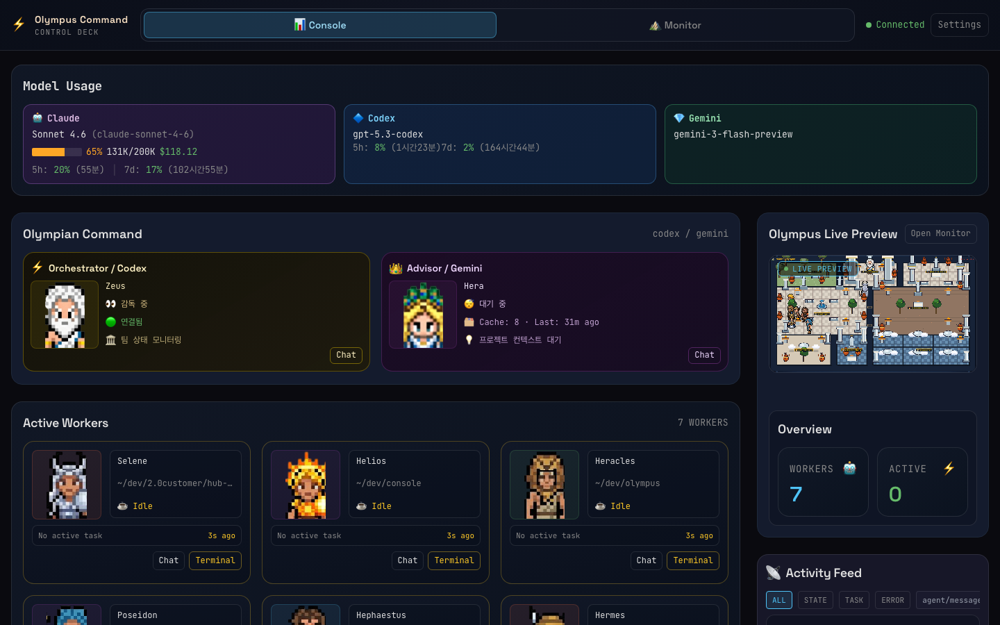
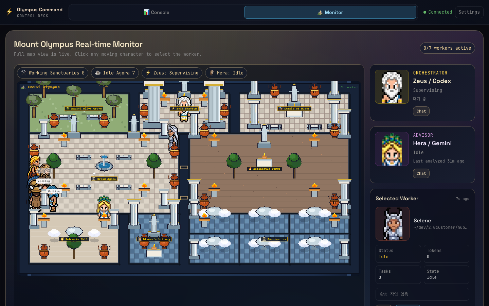

<h1 align="center">Olympus</h1>

<p align="center">
  <a href="./README.md"></a>
  <a href="./README.en.md"></a>
</p>

<p align="center">
  <a href="https://opensource.org/licenses/MIT"></a>
  <a href="https://nodejs.org/"></a>
  <a href="https://www.typescriptlang.org/"></a>
</p>

<p align="center">
  <b>Claude CLI Enhanced Platform v1.0.1</b> — Team Engineering + Gateway + Dashboard
</p>

<p align="center">
  <i>"A Multi-AI collaborative development platform that fills the gaps Claude CLI alone can't cover"</i>
</p>

---

## 📖 Table of Contents

- [Why Olympus?](#-why-olympus)
- [Claude CLI vs Olympus](#-claude-cli-vs-olympus)
- [Quick Start](#-quick-start)
- [Dashboard Screenshots](#-dashboard-screenshots)
- [Key Features](#-key-features)
- [Usage](#-usage)
- [Worker System](#-worker-system)
- [Telegram Bot](#-telegram-bot)
- [Team Engineering Protocol](#-team-engineering-protocol)
- [Architecture](#-architecture)
- [Development](#-development)
- [Troubleshooting](#-troubleshooting)

---

## 🖼️ Dashboard Screenshots

<p align="center">
  
  
</p>

---

## 🏛️ Why Olympus?

Claude CLI is powerful. But developing **on your own** has its limits.

| Problem | Claude CLI Alone | How Olympus Solves It |
|---------|-----------------|----------------------|
| **Single agent** | One Claude handles everything | 19 specialized agents collaborate with role separation |
| **Must be at the terminal** | Close your laptop and it's over | Issue commands from bed via Telegram bot |
| **No visibility into progress** | Scrolling terminal text | Real-time dashboard visualizing all agent activity |
| **Context is volatile** | Everything forgotten when the session ends | SQLite persistent storage + GeminiAdvisor long-term memory synthesis |
| **One at a time** | 1 terminal = 1 CLI | Up to 5 CLIs running in parallel |
| **Claude only** | No way to leverage other AIs | Claude + Gemini + Codex collaboration |

### What Olympus Provides

- 🤖 **19 Specialized Agents** — architect, designer, qa-tester and more auto-collaborate with a single `/team` command
- 📱 **Telegram Remote Control** — Direct worker commands from anywhere with `@worker-name task`
- 📊 **OlympusMountain Dashboard** — Real-time agent monitoring with a Greek mythology theme
- 🧠 **LocalContextStore** — Hierarchical context auto-accumulation per project and worker
- ⚡ **Parallel Execution** — Up to 5 simultaneous CLI spawns via ConcurrencyLimiter
- 🔮 **GeminiAdvisor** — Gemini analyzes your project + synthesizes full work history (up to 50 tasks) for Codex long-term memory

---

## ⚔️ Claude CLI vs Olympus

| Feature | Claude CLI Alone | Olympus |
|---------|-----------------|---------|
| Agents | Manual Task invocation | 19 specialized agents auto-collaborate (`/team`) |
| Remote control | Must be at the terminal | Control from anywhere via Telegram bot |
| Monitoring | Terminal text | Real-time dashboard (OlympusMountain v3) |
| Context | Resets every session | SQLite-based persistent storage (LocalContextStore) |
| Parallel execution | 1 terminal = 1 CLI | ConcurrencyLimiter (up to 5 concurrent) |
| Worker system | None | PTY Worker registration/management/task assignment |
| Multi-AI | Claude only | Claude + Gemini + Codex collaboration |
| Team protocol | None | 5 core mechanisms (Consensus, 2-Phase, Review, QA, Circuit Breaker) |
| Cost tracking | Per-session only | SessionCostTracker (cumulative totals) |

### Before / After Scenarios

#### Scenario 1: Large-Scale Refactoring

**Before — Claude CLI Alone:**
```
# Direct instructions in the terminal
> "Migrate the auth module from JWT to OAuth2"

# Claude works sequentially, alone:
# 1. Code analysis (10 min)
# 2. Write migration code (30 min)
# 3. Fix tests (15 min)
# 4. Fix type errors (10 min)
# 5. Verify build (5 min)
# Total: 70 min, no code review, no security audit
```

**After — Olympus `/team`:**
```
# One line in Claude CLI and you're done
/team "Migrate the auth module from JWT to OAuth2"

# Olympus automatically:
# 1. analyst — Requirements analysis + impact assessment
# 2. architect — Migration design + dependency DAG generation
# 3. executor-1~3 — Parallel code changes (file ownership separation)
# 4. code-reviewer + security-reviewer — Code review + security audit
# 5. qa-tester — Evidence-based testing
# 6. git-master — Atomic commit organization
# Total: 25 min, review complete, security verified
```

#### Scenario 2: Hotfix While Away

**Before — Claude CLI Alone:**
```
# 1. Urgent bug discovered (Slack notification)
# 2. Open laptop... wait, left it at home
# 3. Find a cafe and open laptop (30 min wasted)
# 4. Open terminal and start Claude CLI
# 5. Re-explain context from scratch
```

**After — Olympus + Telegram:**
```
# From your phone via Telegram:

@backend-worker "Fix the null pointer error in the payment API.
Error log: PaymentService.processOrder() line 42"

# The worker immediately:
# 1. Analyzes code + identifies root cause
# 2. Applies fix + confirms tests pass
# 3. Sends results back via Telegram
# Time spent: about as long as it takes to drink a coffee
```

---

## 🚀 Quick Start

### macOS / Linux

```bash
git clone https://github.com/jobc90/olympus.git
cd olympus
./install.sh --global
olympus
```

### Windows

```bash
git clone https://github.com/jobc90/olympus.git
cd olympus

# Git Bash / MINGW (recommended)
./install-win.sh --global

# PowerShell
.\install.ps1 -Mode global
```

### Manual Installation (All Platforms)

```bash
git clone https://github.com/jobc90/olympus.git
cd olympus
pnpm install && pnpm build
cd packages/cli && npm link    # Register olympus as a global CLI
```

> **Windows note**: `install.sh` is for macOS/Linux only. On Windows, use `install-win.sh` (Git Bash) or `install.ps1` (PowerShell). `npm link` creates a `.cmd` wrapper so the `olympus` command works in PowerShell, CMD, and Git Bash.

Once installed, inside Claude CLI:
```bash
/team "Improve the login page UI"
```

---

## ✨ Key Features

| Feature | Description |
|---------|-------------|
| **19 Custom Agents** | 3 Core + 16 On-Demand specialized agents (`.claude/agents/`) |
| **Team Engineering Protocol** | 5 core mechanisms + DAG-based parallel execution + Streaming Reconciliation |
| **PTY Worker** | Persistent Claude CLI via node-pty — TUI display + completion detection + result extraction |
| **Worker Registry** | In-memory worker registration on Gateway + heartbeat + task assignment |
| **stdout Streaming** | Real-time CLI output via WebSocket broadcast (`cli:stream` event) |
| **Parallel CLI Execution** | ConcurrencyLimiter (up to 5 simultaneous runs) |
| **Telegram Worker Delegation** | Direct worker commands via `@mention` + `/team` bot command |
| **LocalContextStore** | SQLite-based hierarchical context store (project/worker level) |
| **GeminiAdvisor** | Gemini CLI-based project analysis + work history synthesis — Codex long-term memory enrichment |
| **OlympusMountain v3** | Greek mythology-themed dashboard (20 god avatars, 10 zones, real-time visualization) |

---

## 🛠️ Usage

### 1. Run Claude CLI (Default)

```bash
olympus
```

Running `olympus` with no arguments starts Claude CLI.

### 2. Start a Worker Session (PTY Mode)

```bash
# Register current directory as a worker
olympus start

# Specify project path + worker name
olympus start -p /path/to/project -n backend-worker

# Auto-approval mode
olympus start-trust
```

`olympus start` registers a PTY Worker with the Gateway and waits for tasks. The Claude CLI TUI is displayed immediately, and worker output is streamed in real time via WebSocket.

### 3. Server Management

```bash
# Start all services (Gateway + Dashboard + Telegram)
olympus server start

# Start individual services (note: --dashboard requires --gateway to be useful)
olympus server start --gateway
olympus server start --telegram

# Custom ports
olympus server start -p 8202 --web-port 8203

# Stop server (use --web-port if Dashboard runs on non-default port)
olympus server stop
olympus server stop --web-port 8203

# Check status
olympus server status
```

> **Ports**: Gateway `8200`, Dashboard `8201` by default.

### 4. Initial Setup

```bash
# Setup wizard (Gateway + Telegram + model configuration)
olympus setup

# Reset all settings (with optional API Key rotation)
olympus setup --reset

# Quick setup + start
olympus quickstart
```

### Installation Mode Options

| Mode | Flag | `~/.claude/` Impact | Recommended For |
|------|------|---------------------|-----------------|
| **Commands only (recommended)** | `--commands` | `commands/` symlink only | Keep existing Claude settings, just use `/team` |
| **Global install** | `--global` | `agents/` + `commands/` + `settings.json` | New users, use agents across all projects |
| **Local install** | `--local` | Not touched at all | Use only inside the Olympus directory |

> **`--commands` mode limitation**: `/team` slash commands work, but MCP tools (`codex_analyze`, `ai_team_patch`, etc.) are disabled. For MCP tools, use `--local` or `--global` mode.

**macOS / Linux:**

```bash
# Recommended — commands only (preserves existing ~/.claude/)
./install.sh --commands

# Global install — agents + commands to ~/.claude/
./install.sh --global

# Local install — only works inside this project
./install.sh --local

# Optionally add Olympus managed block to CLAUDE.md (combinable with any mode)
./install.sh --commands --with-claude-md
```

**Windows (Git Bash / PowerShell):**

```bash
# Git Bash
./install-win.sh --commands
./install-win.sh --global
```

```powershell
# PowerShell
.\install.ps1 -Mode commands
.\install.ps1 -Mode global
.\install.ps1 -Mode local
.\install.ps1 -Mode commands -WithClaudeMd
```

> **Default behavior is non-invasive.** `~/.claude/CLAUDE.md` is not modified unless explicitly requested. `--commands` mode does not touch `~/.claude/agents/`, `settings.json`, or any existing configuration.

---

## ⚙️ Worker System

### PTY Worker

**PTY Worker** is a core module that manages a persistent Claude CLI via node-pty.

- **TUI Display**: Shows the Claude CLI Ink TUI as-is
- **Completion Detection**: Prompt pattern (5s settle) → 30s inactivity → 60s forced completion
- **Background Agent Detection**: 7 patterns + 30s cooldown
- **Result Extraction**: ANSI stripping + TUI artifact filtering → 8000 character limit
- **Fallback**: Automatically switches to spawn mode if PTY mode fails

### Worker Registry

Workers are registered in-memory on the Gateway with heartbeat-based health monitoring.

| API | Description |
|-----|-------------|
| `POST /api/workers/register` | Register worker (mode: `pty` \| `spawn`) |
| `DELETE /api/workers/:id` | Remove worker |
| `POST /api/workers/:id/heartbeat` | Heartbeat (15s check, 60s timeout) |
| `POST /api/workers/:id/task` | Assign task |
| `POST /api/workers/tasks/:taskId/result` | Report task result |
| `GET /api/workers/tasks/:taskId` | Query task status |

---

## 📱 Telegram Bot

Control Claude CLI remotely via Telegram bot.

### Setup

**Step 1**: Create a bot with `@BotFather` → save the token

**Step 2**: Get your User ID from `@userinfobot`

**Step 3**: Set environment variables

```bash
# Add to ~/.zshrc or ~/.bashrc
export TELEGRAM_BOT_TOKEN="7123456789:AAHxxxxxx..."
export ALLOWED_USERS="123456789"  # Comma-separated for multiple users
```

> **⚠️ Security**: If `ALLOWED_USERS` is not set, the bot silently rejects all requests. Get your ID from [@userinfobot](https://t.me/userinfobot) and set it before starting the server.

> **API Key**: Auto-generated on first run and stored in `~/.olympus/config.json`. View with `olympus setup`.

**Step 4**: Start the server

```bash
olympus server start
# Or Telegram bot only: olympus server start --telegram
```

### Commands

| Command | Description |
|---------|-------------|
| `/start` | Show help |
| `/health` | Check status |
| `/workers` | List workers |
| `/team <request>` | Run Team Engineering Protocol |
| Plain message | Send to Claude CLI |
| `@worker-name task` | Direct task assignment to worker |

**Inline queries**: Type `@your-bot-name` in any chat to see available workers.

---

## 🏟️ Team Engineering Protocol

A team engineering framework where 19 specialized agents collaborate.

### How to Use

```bash
# In Claude CLI
/team "Improve the login page UI"

# Via Telegram bot
/team Add shopping cart feature

# Delegate team task to a worker
@backend-worker team Optimize API performance
```

### 5 Core Mechanisms

| Mechanism | Description |
|-----------|-------------|
| **Consensus Protocol** | Leader (Claude) gathers team input for key decisions |
| **2-Phase Development** | Coding Phase → Debugging Phase separation (prevents masking issues by modifying tests) |
| **Two-Stage Review** | Stage 1 (spec compliance) → Stage 2 (code quality); Stage 2 skipped if Stage 1 fails |
| **Evidence-Based QA** | All assertions require captured evidence; assumption-based judgments prohibited |
| **Circuit Breaker** | Re-evaluates approach after 3 failures; prevents infinite loops |

### Agent Activation Policy

**Core Agents (Always Available — 3)**:

| Agent | Model | Role |
|-------|-------|------|
| `explore` | Haiku | Fast codebase search |
| `executor` | Sonnet | Focused execution, direct implementation |
| `writer` | Haiku | Documentation |

**On-Demand Agents (Team Mode Only — 16)**:

| Agent | Model | Role |
|-------|-------|------|
| `architect` | Opus | Architecture design & debugging |
| `analyst` | Opus | Requirements analysis |
| `planner` | Opus | Strategic planning |
| `designer` | Sonnet | UI/UX design |
| `researcher` | Sonnet | Documentation & research |
| `code-reviewer` | Opus | Code review (2-stage) |
| `verifier` | Sonnet | Visual analysis |
| `qa-tester` | Sonnet | Evidence-based testing |
| `vision` | Sonnet | Screenshot/diagram analysis |
| `test-engineer` | Sonnet | Test design/implementation |
| `build-fixer` | Sonnet | Build/type error resolution |
| `git-master` | Sonnet | Git workflow |
| `api-reviewer` | Sonnet | API design review |
| `performance-reviewer` | Sonnet | Performance optimization review |
| `security-reviewer` | Sonnet | Security vulnerability review |
| `style-reviewer` | Haiku | Code style review |

### Verifying Installation

```bash
# Global install
ls ~/.claude/agents/    # 19 .md files

# Local install
ls .claude/agents/
```

---

## 🏗️ Architecture

### Package Structure (9 Packages)

```
protocol → core → gateway ──→ cli
    │        │        ↑         ↑
    ├→ client → tui ──┤─────────┤
    │        └→ web   │         │
    ├→ telegram-bot ──┘─────────┘
    └→ codex (Codex Orchestrator)
```

### Gateway Internal Architecture

```
┌──────────────────────── Gateway ─────────────────────────┐
│                                                           │
│  Claude CLI ◄── CliRunner ──────► real-time stdout stream │
│  Codex CLI  ◄── CodexAdapter ◄──► codex package          │
│  Gemini CLI ◄── GeminiAdvisor ──► context enrichment     │
│                     │              (Athena)               │
│                     ├──► Auto-injects project analysis    │
│                     │    into Codex chat / Worker tasks   │
│                     └──► Memory Synthesizer: ALL worker   │
│                          history (50) → Codex long-term   │
│                                                           │
│  WorkerRegistry · MemoryStore · SessionStore              │
│  LocalContextStore (SQLite + FTS5 hierarchical context)   │
└───────────────────────────────────────────────────────────┘
```

| Package | Role |
|---------|------|
| `protocol` | Message types, Agent state machine, Worker/Task/CliRunner interfaces |
| `core` | Multi-AI orchestration, TaskStore (SQLite), LocalContextStore |
| `gateway` | HTTP + WebSocket server, CliRunner, Worker Registry, Session Store |
| `client` | WebSocket client (auto-reconnect, event subscriptions) |
| `cli` | Main CLI, Claude CLI wrapper, PTY Worker |
| `web` | React dashboard (OlympusMountain v3, LiveOutputPanel) |
| `telegram-bot` | Telegram bot (worker delegation, `/team`, `/workers`) |
| `tui` | Terminal UI (React + Ink) |
| `codex` | Codex Orchestrator (routing, session management) |

### Core Modules

| Module | Location | Description |
|--------|----------|-------------|
| **CliRunner** | `gateway/src/cli-runner.ts` | CLI spawn → JSON/JSONL parse + real-time stdout streaming |
| **PTY Worker** | `cli/src/pty-worker.ts` | Persistent CLI via node-pty — completion detection, result extraction |
| **Worker Registry** | `gateway/src/worker-registry.ts` | In-memory worker registration + heartbeat (15s/60s) |
| **Session Store** | `gateway/src/cli-session-store.ts` | SQLite session storage (token/cost accumulation) |
| **LocalContextStore** | `core/src/local-context-store.ts` | SQLite hierarchical context (FTS5 full-text search) |
| **GeminiAdvisor** | `gateway/src/gemini-advisor.ts` | Gemini CLI project analysis + work history synthesis (PTY + spawn fallback) |

---

## 💻 Development

### Prerequisites

- **Node.js 22+** (recommended)
- **pnpm** (`npm i -g pnpm`)
- **Claude CLI** (`npm i -g @anthropic-ai/claude-code`)
- **Build tools** (for node-pty native module):
  - macOS: `xcode-select --install`
  - Linux: `build-essential`, `python3`
  - Windows: Visual Studio Build Tools + Python 3
- **Gemini CLI** (optional): Required for Multi-AI collaboration
- **Codex CLI** (optional): Required for Multi-AI collaboration

### Build + Test

```bash
pnpm install && pnpm build    # Full build
pnpm test                     # Run all tests
pnpm lint                     # TypeScript type check (6 packages)
pnpm dev                      # Development mode
```

### Run CLI Locally

```bash
cd packages/cli
pnpm build
node dist/index.js
```

---

## 🔧 Troubleshooting

### "Failed to fetch" Error in Dashboard

**Cause**: Gateway not running or CORS configuration issue

**Solution**:
1. Start the server with `olympus server start`
2. CORS is allowed by default for the Vite dev server (port 5173)
3. **Always restart** after changing Gateway settings

### CLI Output Not Showing in Dashboard

**Cause**: Gateway not running or WebSocket connection lost

**Solution**:
1. Check status with `olympus server status`
2. Restart with `olympus server start`

### `olympus` Command Not Recognized on Windows

**Solution**:
```bash
# Git Bash
./install-win.sh --global

# PowerShell
.\install.ps1 -Mode global

# Manual (all shells)
cd packages/cli && npm link
olympus --version
```

### node-pty Build Failure

**Solution**:
- **macOS**: `xcode-select --install`
- **Linux**: `sudo apt install build-essential python3`
- **Windows**: Visual Studio Build Tools + Python 3

### Telegram Bot Not Responding

**Cause 1 — `ALLOWED_USERS` not set**: All requests are silently rejected when no users are registered.

```bash
# Get your ID: send /start to @userinfobot
export ALLOWED_USERS="123456789"   # Add to ~/.zshrc then source it
```

**Cause 2 — DM policy**: If you copied `.env.example`, `TELEGRAM_DM_POLICY=allowlist` is the default. Changing to `allow` opens the bot to anyone — use with caution.

**Cause 3 — Server not running**:
```bash
olympus server start   # starts Gateway + Telegram together
```

**Verify**: Send `/health` to your bot → `✅ Gateway connected` means everything is working.

### `/team` Command Not Recognized

**Solution**:
1. Verify global install: `ls ~/.claude/agents/` (19 files)
2. Reinstall: `./install.sh --global`

---

## License

MIT

---

<p align="center">
  <b>Olympus v1.0.1</b> — A Multi-AI collaborative development platform for supercharging Claude CLI productivity
</p>
